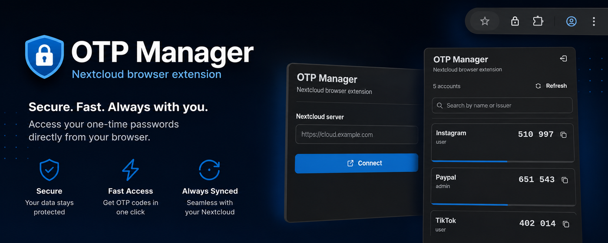
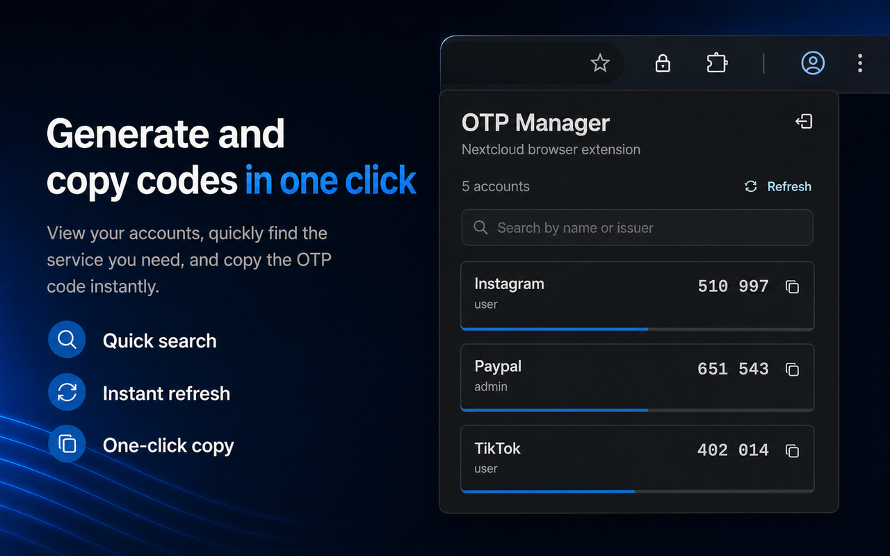

# Nextcloud OTP Manager Browser Extension

# Useful Links

- *Firefox Add-Ons: [otpmanager for Firefox](https://addons.mozilla.org/firefox/addon/nextcloud-otp-manager/)*
- *Chrome Web Store: [otpmanager for Chrome](https://chromewebstore.google.com/detail/ljbdflkioncfbcncbnijleofalpakhlf)*
- *Official Nextcloud OTP Manager repository: [otpmanager-nextcloud](https://github.com/matteo-convertino/otpmanager-nextcloud)*
- *Medium article: [How to develop a Nextcloud App Extension (Part-1): A practical guide based on a real project](https://medium.com/@matteo-convertino/how-to-develop-a-nextcloud-app-extension-part-1-a-practical-guide-based-on-a-real-project-00b4395a64f7)*

# Screenshots

# Description

OTP Manager Browser Extension is the official browser extension for OTP Manager on Nextcloud. It is designed for users who rely on two-factor authentication and want fast, secure access to their OTP codes without leaving the browser.

After connecting the extension to your Nextcloud server, you can view your OTP accounts, search by account name or issuer, generate TOTP and HOTP codes, and copy them with a single click. TOTP accounts include a progress indicator that shows how much time is left before the next code is generated, while HOTP accounts can be refreshed manually when needed.

The extension also supports shared OTP accounts managed through OTP Manager, clearly indicating when an account must be unlocked before its code can be used.

With OTP Manager Browser Extension, your OTP codes stay synchronized with your personal Nextcloud server while remaining simple, fast, and convenient to access whenever you need them.
